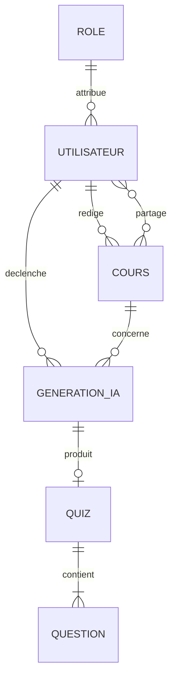

# Conception de la base de données — méthode Merise

## Pourquoi deux bases de données (PostgreSQL ET MongoDB) ?

Ce projet utilise **deux bases en parallèle**, chacune pour ce qu'elle fait le mieux —
ce n'est pas un mélange accidentel ni une complexité gratuite. Deux raisons :

1. **Exigence de l'examen** : le REAC évalue une compétence explicite,
   *"Développer des composants d'accès aux données SQL et NoSQL"*. Le jury doit voir du
   code d'accès aux deux types de bases dans le même projet.
2. **Justification technique réelle** : chaque entité va dans la base la mieux adaptée
   à sa structure.
   - **PostgreSQL (SQL, relationnel)** pour les données à structure fixe et aux relations
     claires : `UTILISATEUR`, `COURS`, `GENERATION_IA`.
   - **MongoDB (NoSQL, document)** pour `QUIZ`/`QUESTION` : une question QCM a des choix,
     une question Vrai/Faux a une explication, une question ouverte n'a ni l'un ni
     l'autre — un schéma relationnel rigide forcerait des colonnes vides selon le type,
     un document flexible n'a pas ce problème.

Une opération métier peut utiliser les deux bases : la génération lit le cours et écrit son journal dans PostgreSQL, puis conserve le quiz dans MongoDB. Cette persistance polyglotte impose de vérifier la propriété du cours, de gérer les écritures partielles et de supprimer explicitement les quiz MongoDB lors de la suppression d’un cours. Les cascades SQL ne couvrent pas MongoDB. Ces comportements restent à implémenter avec le module métier.

## Démarche Merise suivie

Le MCD ci-dessous est **conceptuel** : il décrit tout le comportement final visé pour
EduQuizAI (MVP + fonctionnalités bonus de `FONCTIONNALITES.md`), indépendamment de la
technologie de stockage. Le choix SQL/NoSQL par entité, et ce qu'on implémente
maintenant vs plus tard, est expliqué dans la section MPD, en toute fin de document.
C'est la démarche Merise correcte : on modélise le réel avant de choisir la technologie.

## MCD — Entités et attributs

| Entité | Attributs |
|---|---|
| **ROLE** | id_role (id), libelle |
| **UTILISATEUR** | id_utilisateur (id), nom, email, mot_de_passe_hache, consentement_rgpd, date_consentement, date_creation |
| **COURS** | id_cours (id), titre, contenu_texte, date_creation |
| **GENERATION_IA** | id_generation (id), date_generation, statut, duree_ms, nombre_questions_demandees |
| **QUIZ** | id_quiz (id), titre, statut, date_creation |
| **QUESTION** | id_question (id), type, enonce, choix, bonne_reponse, explication |
| **PARTAGE** | id_partage (id), date_partage |

## MCD — Associations et cardinalités

| Association | Entité A | Card. A | Entité B | Card. B | Sens |
|---|---|---|---|---|---|
| ATTRIBUER | ROLE | (0,n) | UTILISATEUR | (1,1) | un rôle est attribué à 0..N utilisateurs ; un utilisateur a exactement 1 rôle |
| RÉDIGE | UTILISATEUR | (0,n) | COURS | (1,1) | un utilisateur rédige 0..N cours ; un cours a exactement 1 rédacteur |
| DÉCLENCHE | UTILISATEUR | (0,n) | GENERATION_IA | (1,1) | un utilisateur déclenche 0..N générations ; une génération est déclenchée par exactement 1 utilisateur |
| CONCERNE | COURS | (0,n) | GENERATION_IA | (1,1) | un cours fait l'objet de 0..N générations ; une génération concerne exactement 1 cours |
| PRODUIT | GENERATION_IA | (0,1) | QUIZ | (1,1) | une génération produit 0 ou 1 quiz (0 si échec) ; un quiz provient d'exactement 1 génération |
| CONTIENT | QUIZ | (1,n) | QUESTION | (1,1) | un quiz contient 1..N questions ; une question appartient à exactement 1 quiz |
| PARTAGE (assoc. porteuse) | COURS | (0,n) | UTILISATEUR | (0,n) | un cours est partagé avec 0..N utilisateurs ; un utilisateur reçoit 0..N cours partagés |

## Version visuelle (Mermaid, notation "pied de poule" — le tableau ci-dessus fait foi pour la notation Merise)



## MLD — Modèle Logique de Données (notation Merise, # = clé étrangère)

```
ROLE (id_role, libelle)
UTILISATEUR (id_utilisateur, nom, email, mot_de_passe_hache, consentement_rgpd, date_consentement, date_creation, #id_role)
COURS (id_cours, titre, contenu_texte, date_creation, #id_utilisateur)
GENERATION_IA (id_generation, date_generation, statut, duree_ms, nombre_questions_demandees, #id_utilisateur, #id_cours)
QUIZ (id_quiz, titre, statut, date_creation, #id_generation)
QUESTION (id_question, type, enonce, choix, bonne_reponse, explication, #id_quiz)
PARTAGE (id_partage, date_partage, #id_cours, #id_utilisateur)
```

## MPD — stratégie d'implémentation physique (le SQL/NoSQL se décide ici, pas avant)

Le MCD est complet ; sa traduction physique est volontairement **progressive**, dans le
même esprit MVP que le reste du projet.

### Implémenté maintenant (PostgreSQL, script `back/src/config/schema.sql`)

- **UTILISATEUR** — simplifié pour le MVP : pas de table ROLE séparée tant qu'un seul
  rôle existe, une colonne `role VARCHAR DEFAULT 'enseignant'` suffit. La table ROLE
  sera créée si la fonctionnalité multi-rôles (admin/enseignant) est activée.
- **COURS**
- **GENERATION_IA** — avec `ON DELETE CASCADE` sur `id_utilisateur` et `id_cours`
  (obligatoire pour respecter le droit à l'effacement RGPD : supprimer un compte doit
  supprimer son historique de générations)

### Dénormalisé volontairement en NoSQL (MongoDB, collection `quiz`)

Au niveau conceptuel, QUIZ et QUESTION sont deux entités distinctes avec une relation
1-N propre. Au niveau physique, on choisit de les **fusionner en un seul document**
MongoDB (QUESTION devient un tableau embarqué dans QUIZ) parce que :
- la structure d'une question varie selon son type (QCM a des choix, Vrai/Faux a une
  explication, question ouverte n'a ni l'un ni l'autre) — un schéma relationnel rigide
  forcerait des colonnes nullable ou une table par type, ce qui alourdit sans bénéfice
- un quiz est toujours lu et affiché en entier (jamais question par question) : pas de
  besoin de jointure, l'embarquement est la pratique standard en NoSQL dans ce cas

C'est exactement ce que la compétence REAC "Développer des composants d'accès aux
données SQL et NoSQL" attend : un choix de technologie **justifié par entité**, pas
une base "parce que c'est plus flexible" sans analyse.

```json
{
  "_id": "ObjectId",
  "id_generation": 17,
  "id_cours": 42,
  "titre": "Quiz - Chapitre 3",
  "statut": "brouillon",
  "questions": [
    {
      "type": "qcm",
      "enonce": "Quelle est la capitale de la France ?",
      "choix": ["Lyon", "Paris", "Marseille"],
      "bonne_reponse": 1
    },
    {
      "type": "vrai_faux",
      "enonce": "La Terre est plate.",
      "reponse": false,
      "explication": "La Terre est un sphéroïde aplati."
    }
  ],
  "date_creation": "ISODate"
}
```

### Différé (phase bonus, à créer si la fonctionnalité est activée)

- **ROLE** (PostgreSQL) — si la gestion admin/enseignant est développée
- **PARTAGE** (PostgreSQL) — si le partage de cours entre enseignants est développé
