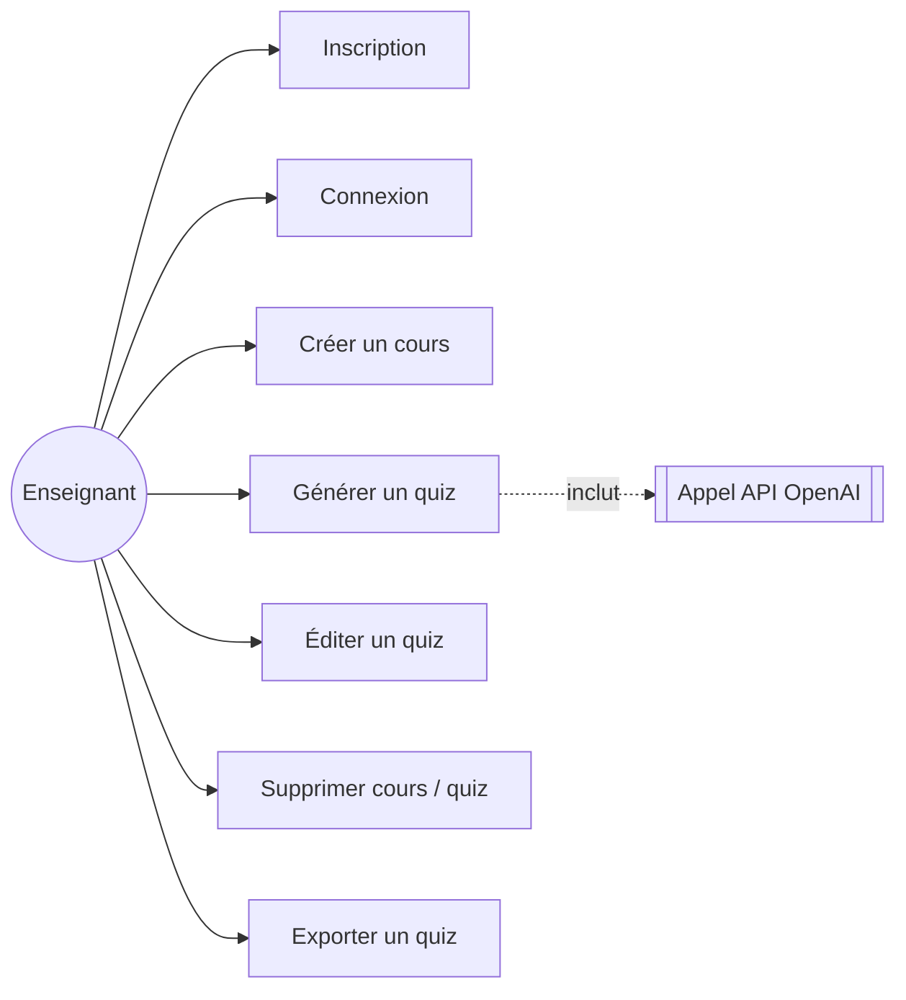
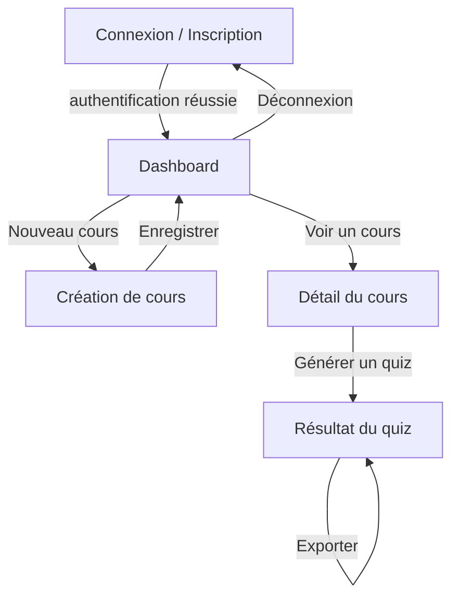

# Diagrammes — EduQuizAI

Diagrammes au format Mermaid (texte → image). Se rendent nativement sur GitHub/GitLab ou
via https://mermaid.live pour export en image à coller dans le dossier Word.

## Diagramme de cas d'utilisation

## Diagramme d'enchaînement des écrans

