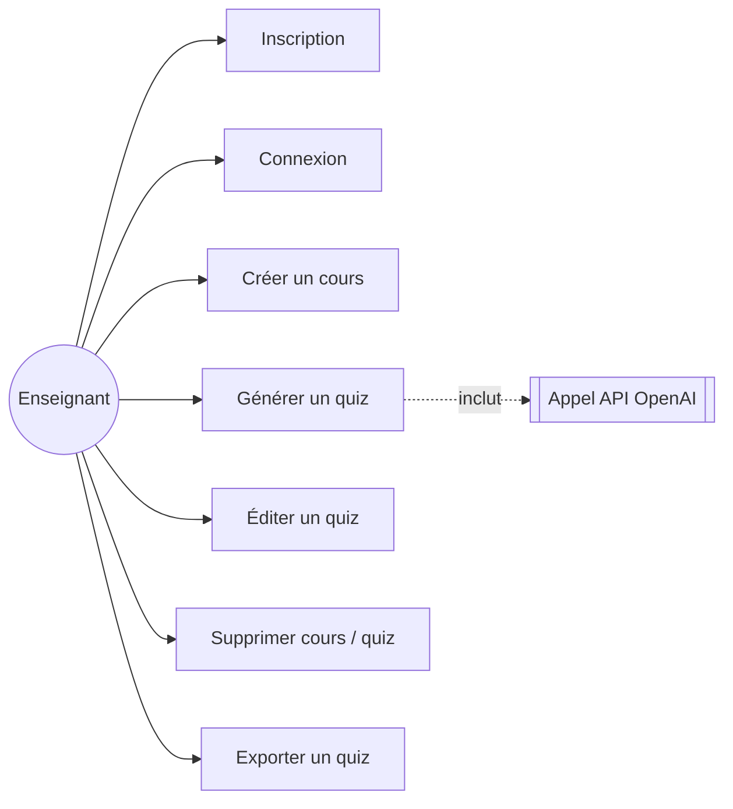
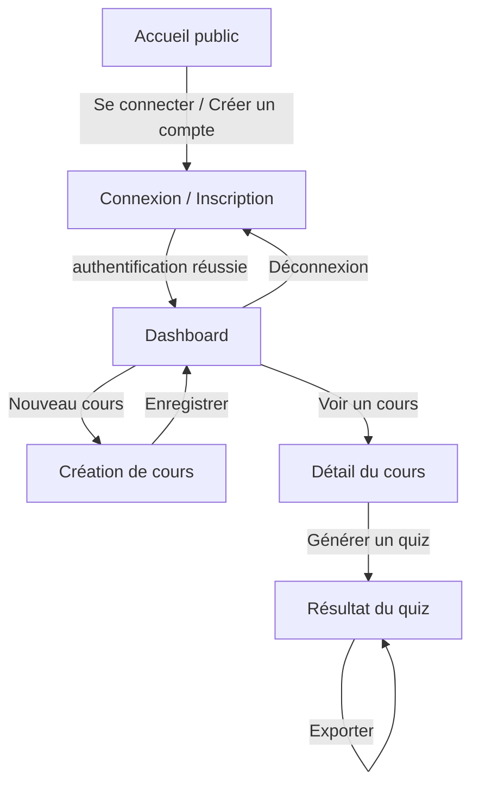
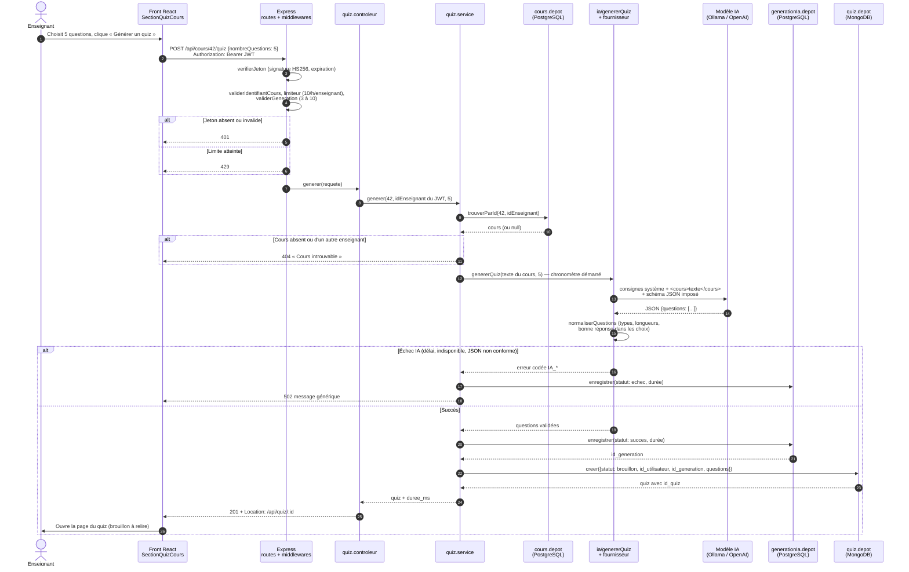

# Diagrammes — EduQuizAI

Diagrammes au format Mermaid (texte → image). Se rendent nativement sur GitHub/GitLab ou
via https://mermaid.live pour export en image à coller dans le dossier Word.

## Diagramme de cas d'utilisation

## Diagramme d'enchaînement des écrans

## Diagramme de séquence — Générer un quiz (cas d'utilisation le plus significatif)

Il traverse toutes les couches de l'architecture et les deux bases de données, et
montre les trois protections clés : contrôle de propriété, validation de la réponse de
l'IA et brouillon soumis à validation humaine.

